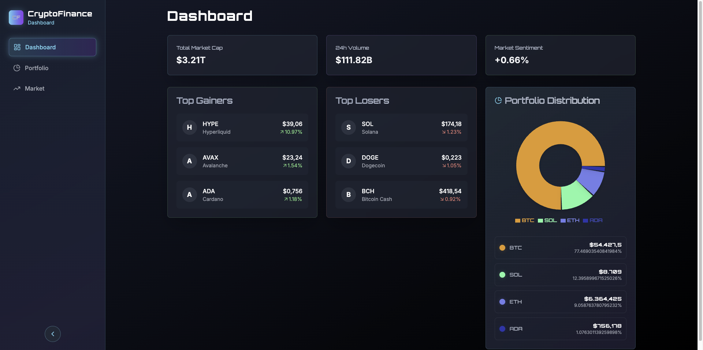

# Future Finance - Modern Cryptocurrency Dashboard

A modern, real-time cryptocurrency dashboard built with Next.js, TypeScript, and Tailwind CSS. Track your portfolio, monitor market trends, and stay updated with the latest crypto movements.

🌐 **Live Demo:** [https://future-finance-seven.vercel.app/](https://future-finance-seven.vercel.app/)



## 🌟 Features

### Real-time Market Data
- Live cryptocurrency prices and market data
- 24-hour price changes and trends
- Market cap and volume tracking
- Top gainers and losers monitoring

### Portfolio Management
- Interactive portfolio distribution chart
- Real-time portfolio value tracking
- Asset allocation visualization
- Performance metrics and analytics

### Modern UI/UX
- Clean, responsive design
- Dark mode optimized interface
- Smooth animations and transitions
- Intuitive navigation

### Technical Features
- Server-side rendering with Next.js
- Type-safe development with TypeScript
- Responsive design with Tailwind CSS
- Real-time data updates
- Redux state management
- Mock data support for development

## 🚀 Getting Started

### Prerequisites
- Node.js 18+ 
- npm or yarn
- Git

### Installation

1. Clone the repository:
```bash
git clone https://github.com/yourusername/future-finance.git
cd future-finance
```

2. Install dependencies:
```bash
npm install
# or
yarn install
```

3. Create a `.env.local` file in the root directory and add your API keys:
```env
NEXT_PUBLIC_COINCAP_API_KEY=your_api_key_here
```

4. Start the development server:
```bash
npm run dev
# or
yarn dev
```

5. Open [http://localhost:3000](http://localhost:3000) in your browser.

## 🛠️ Tech Stack

- **Framework:** Next.js 14
- **Language:** TypeScript
- **Styling:** Tailwind CSS
- **State Management:** Redux Toolkit
- **Charts:** Recharts
- **Icons:** Lucide Icons
- **UI Components:** Shadcn/ui

## 📊 Data Sources

The application uses the CoinCap API for real-time cryptocurrency data:
- Market prices
- 24h changes
- Market caps
- Trading volumes

## 🎨 Features in Detail

### Dashboard
- Market overview with key metrics
- Portfolio distribution visualization
- Top performing cryptocurrencies
- Market sentiment indicators

### Portfolio
- Asset allocation breakdown
- Performance tracking
- Value distribution charts
- Historical data visualization

### Market
- Real-time price updates
- Market cap rankings
- Volume analysis
- Price change tracking

## 🤝 Contributing

Contributions are welcome! Please feel free to submit a Pull Request.

1. Fork the repository
2. Create your feature branch (`git checkout -b feature/AmazingFeature`)
3. Commit your changes (`git commit -m 'Add some AmazingFeature'`)
4. Push to the branch (`git push origin feature/AmazingFeature`)
5. Open a Pull Request

## 📝 License

This project is licensed under the MIT License - see the [LICENSE](LICENSE) file for details.

## 🙏 Acknowledgments

- [CoinCap API](https://docs.coincap.io/) for cryptocurrency data
- [Next.js](https://nextjs.org/) for the framework
- [Tailwind CSS](https://tailwindcss.com/) for styling
- [Shadcn/ui](https://ui.shadcn.com/) for UI components

## 📧 Contact

Your Name - [@yourtwitter](https://twitter.com/yourtwitter)

Project Link: [https://github.com/yourusername/future-finance](https://github.com/yourusername/future-finance)
